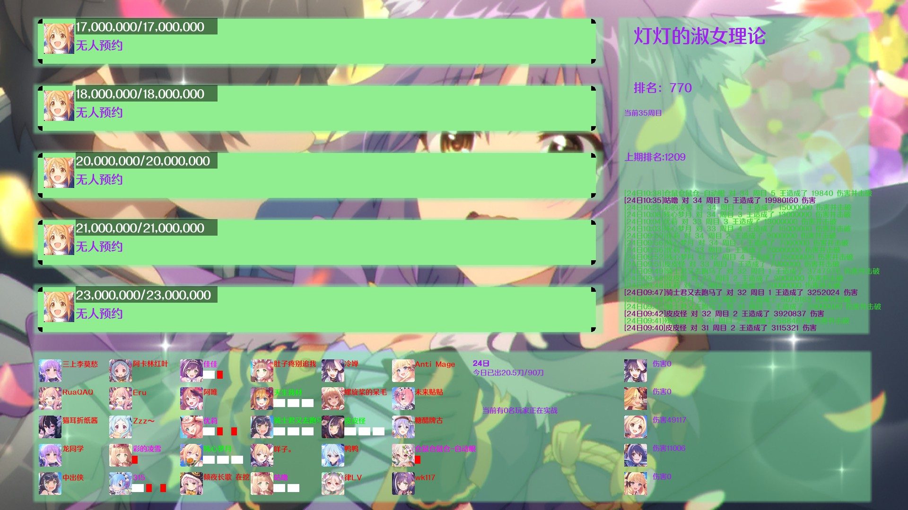
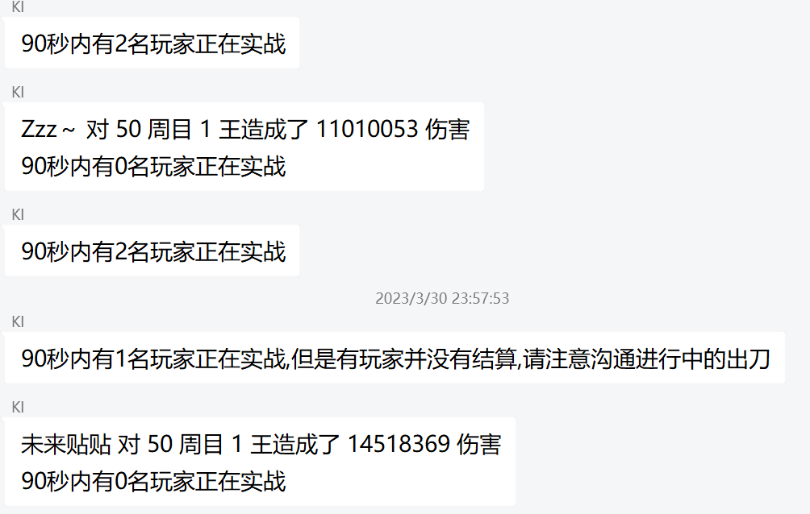
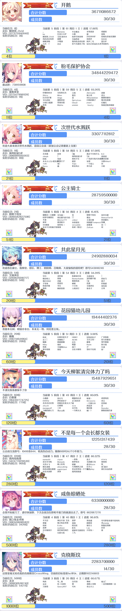

# 基于pcrjjc2的会战推送插件

**本项目基于AGPL v3协议开源**

现在应该能根据时间正确判断出刀类型了(把boss打残了就能看到后面的色图了，这算不算某种程度的脱衣<--自己在310张卡面里面塞了35张脱衣卡面，抽卡色图什么的弱爆了
## 配置方法

1. 打开hoshino插件文件夹
2. git clone https://github.com/AddOneSecondL/pcrjjc2-clanbattle.git
3. __init__.py 第32行改成需要推送的群
4. config文件里面添加pcrjjc2-clanbattle
5. account.json填上在会里的号的账号密码
6. 发送会战状态可以查看当前会战状态
7. 会战前一天请清空output.txt并输入初始化会战推送
8. 会战期间输入 切换会战推送 来打开/关闭推送，默认关闭
9. 关于查档线功能，结算时不能获取数据，官方结算完和会战开启时可以使用，通过获取游戏内数据，输入 查档线 可以查看各档档线，输入 查档线 1,2,3,4 可以查看 1,2,3,4 名详情，其他名次也是这样
10. 查档线新增一种按名字查询的方法， 查档线 行会名，会列出部分符合条件的行会
11. 输入 sl + ID(可以关键词)：标记SL
12. 实验模式：位于account.json，"push_group"用于调整推送群，英文逗号分割。
                               "ingame_calc_mode"用于调整实战人数显示方式(0/1)。
                               "statu_text_mode"用于调整 会战状态 指令文字输出还是图片输出(0/1)。
                               "only_admin"用于调整部分指令是否仅管理员以上级别可用(0/1)。

自用改的渣代码，见谅

要做的事：
1.优化图片排版
2.自动获取会战日期(应该找个日历源就行，游戏内可以但是需要登陆
3.获取当期BOSS头像(不知道下期bossid上哪找
4.想到了再改吧

更新日志：
6.17 - 新增清空留言板；优化会战币获取，减少弹出次数；使用累计进入实战人数模式时，当boss被击杀后会重置进入实战人数。
6.8 - 修改了会战状态周目中的颜色，增加出刀时段统计，新增留言板，重启后重置留言板。

最终看起来应该是这样子的

查档线

